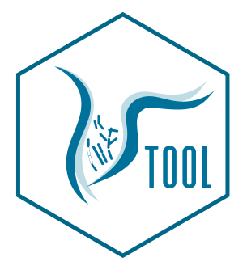

<!-- README.md is generated from README.Rmd. Please edit that file -->

# `{vtool}`

<!-- badges: start -->



[](https://lifecycle.r-lib.org/articles/stages.html#experimental)
<!-- badges: end -->

## Installation

You can install the development version of `{vtool}` like so:

``` r
# install.packages("devtools") #un-comment if devtools not installed already
devtools::install_github("IMTAvH/vtool")
```

## Run

You can launch the application by running:

``` r
vtool::run_app()
```

## About

You are reading the doc about version : 0.0.0.9000

This README has been compiled on the

``` r
Sys.time()
#> [1] "2024-09-01 23:43:06 -05"
```

Here are the tests results and package coverage:

``` r
devtools::check(quiet = TRUE)
#> ℹ Loading vtool
#> ── R CMD check results ─────────────────────────────────── vtool 0.0.0.9000 ────
#> Duration: 9s
#> 
#> 0 errors ✔ | 0 warnings ✔ | 0 notes ✔
```

``` r
covr::package_coverage()
#> vtool Coverage: 68.42%
#> R/app_config.R: 0.00%
#> R/app_server.R: 0.00%
#> R/app_ui.R: 0.00%
#> R/run_app.R: 0.00%
#> R/mod_panel_contenido.R: 100.00%
#> R/mod_panel_superior.R: 100.00%
```
